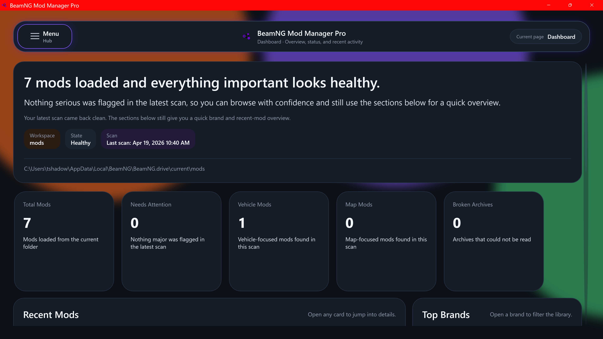

# BeamNG Mod Manager Pro

**BeamNG Mod Manager Pro** is a modern desktop mod manager for **BeamNG.drive**. It is built around safe downloads, a staged Mod Library, deploy/undeploy controls, profiles, health checks, category detection, and a cleaner way to browse BeamNG Resources.

> **Alpha notice:** this project is currently in public alpha. Bugs, rough edges, and missing polish are expected. Please report issues with screenshots and clear steps to reproduce.

---

## Why use this instead of only the in-game mod manager?

BeamNG.drive already has an in-game mod manager, and it is still useful for basic enable/disable tasks. **BeamNG Mod Manager Pro** is meant to go further by giving you a safer external workspace before mods touch your live game folder.

Instead of treating every ZIP as something that immediately belongs in the active BeamNG mods directory, BeamNG Mod Manager Pro uses a **staged library** approach:

- Import mods into a managed library first.
- Inspect them before deployment.
- Deploy or undeploy them when you are ready.
- Keep track of what is staged, what is deployed, and what may need attention.
- Use profiles to organize different setups.
- Browse BeamNG Resources from inside the app.
- Capture downloads safely and validate ZIPs before staging them.
- Open mod folders, inspect details, and review health/category information from one place.

In short: the in-game manager is good for quick game-side control. **BeamNG Mod Manager Pro is designed to be a full mod organization, download, staging, and maintenance workspace.**

---

## Screenshots

### Dashboard



The Dashboard gives you a quick overview of your current mod setup, including loaded mods, attention items, staged content, and quick access to common areas.

### Workspace Navigation Hub


The animated workspace hub gives the app a fast, visual way to move between Dashboard, Mod Library, Downloads, Repository Browser, Health Center, Profiles, and Settings.

### Mod Library


The Mod Library is the heart of the app. It shows your managed mods, detected categories, previews, deploy status, and quick actions.

### Mod Details


Each mod has a details page with preview artwork, detected category, health/status information, deploy controls, and file actions.

### Repository Browser


Browse BeamNG Resources directly inside the app. Supported mod pages can be sent through the app's safe download and staging flow.

### Downloads


The Downloads page keeps incoming ZIP imports, captured downloads, and recent activity separate from your main Mod Library.

### Health Center


Health Center scans staged and deployed mods for common archive, preview, category, dependency, and structure issues.

### Profiles


Profiles help organize different mod setups so you can keep separate collections for different play styles, testing, or mod groups.

### Settings


Settings includes paths, app updates, browser/extension status, safety backups, theme options, and other configuration areas.

---

## Download

Get the latest alpha from the **Releases** section:

**Latest release:** [BeamNG Mod Manager Pro v1.0.72 Alpha 1](https://github.com/iwrcproject/BeamNG-Mod-Manager-Pro/releases/tag/v1_0_72_alpha_1)

After downloading:

1. Download the release ZIP.
2. Extract the ZIP to a normal folder.
3. Run:

```text
BeamNG.ModManagerPro.exe
```

Do **not** run the app directly from inside the ZIP. Extract it first.

---

## Requirements

- Windows 10/11 x64
- BeamNG.drive installed
- .NET 10 Desktop Runtime may be required for this alpha build
- Microsoft Edge WebView2 Runtime may be required for the built-in browser if it is not already installed

---

## Core Features

### Staged Mod Library

BeamNG Mod Manager Pro uses a staged library model inspired by larger mod managers. Mods are imported into the app first, then deployed into BeamNG when you choose.

This helps avoid turning your live BeamNG mods folder into a dumping ground of random ZIPs.

Current Mod Library features include:

- Import BeamNG mod ZIPs into a managed library.
- See staged and deployed status.
- Deploy and undeploy mods.
- Open mod details.
- Remove managed mods.
- Open the mod's folder directly from the card or details page.
- Filter and search your mod collection.
- View category badges and detected mod type information.

### Deploy and Undeploy Flow

The app is designed around safer mod movement:

- Stage first.
- Deploy only when ready.
- Undeploy without manually hunting through folders.
- Keep deployed state visible from the library.
- Keep Dashboard, Health Center, and Profiles aligned around the staged library.

### Mod Details

The Details page gives each mod a focused view with:

- Preview image.
- Mod name and archive information.
- Detected category.
- Category confidence/explanation.
- Deploy/undeploy action.
- Open mod folder action.
- Health/status information.

### Smart Category Detection

BeamNG Mod Manager Pro attempts to detect common BeamNG mod categories, including:

- Vehicles
- Automation vehicles
- Maps / terrains / levels
- Scenarios
- UI apps
- Sound packs
- License plates
- Track Builder content
- Skin packs
- Config packs
- Gameplay / script packs
- Dependency / addon mods
- Mixed-content mod packs
- Unknown or unusual archives

The Mod Library can show category badges and filter by category.

### Repository Browser

The built-in Repository Browser lets you browse BeamNG Resources from inside the app.

Repository Browser features include:

- In-app BeamNG Resources browsing.
- Back, forward, refresh, home, and open-in-browser controls.
- Read-only BeamNG location display.
- Built-in download action on supported mod pages.
- Safe handoff into the app's download/staging pipeline.

The browser is intended for trusted BeamNG Resources pages, not as a general-purpose web browser.

### Downloads Page

Downloads are kept separate from the Mod Library so users can review incoming files before they become part of their managed collection.

Downloads features include:

- Manual ZIP import.
- Captured downloads from the built-in Repository Browser.
- Browser extension download support.
- Recent activity/status area.
- Failed download handling.
- Validation before files enter the Mod Library.

### Health Center

Health Center helps find problems before they become confusing in-game issues.

Current checks and workflows include:

- Scan staged and deployed mods.
- Detect common archive problems.
- Flag missing or weak preview images.
- Surface category/dependency concerns.
- Show quick issue summaries.
- Use a modern loading card while scans run.

Health Center is still growing during alpha. More category-specific checks are planned.

### Profiles

Profiles are meant to help organize different mod setups.

Examples:

- Main gameplay setup.
- Testing/Sandbox setup.
- Racing setup.
- Crawling/off-road setup.
- Multiplayer-friendly setup.

Profiles are part of the staged/deployed workflow and will continue to expand in future updates.

### Safety and Validation

The app is built around avoiding silent bad imports.

Safety behavior includes:

- ZIP validation before staging.
- Failed download handling.
- Dangerous ZIP path checks.
- Partial download handling.
- Duplicate active download guard.
- Deployment backup support.
- Restore support for safety backups where available.
- SHA-256 verification for app updates.

### App Updates

BeamNG Mod Manager Pro includes a built-in app update system.

The updater can:

- Check a remote update manifest.
- Show update information during startup.
- Download update packages.
- Verify package SHA-256 before install.
- Back up the current install before replacing files.
- Attempt rollback if the update install fails.

The current public update feed uses:

```text
update/stable.json
```

from this GitHub repository.

### Browser Extensions

BeamNG Mod Manager Pro supports optional browser extension download capture.

Firefox extension:

```text
https://addons.mozilla.org/en-US/firefox/addon/beamng-mod-manager-pro/
```

Chrome extension:

```text
https://chromewebstore.google.com/detail/beamng-mod-manager-pro/ncgfhgbmpkgfmdilddjpfalmmkbdilfe
```

The extensions are optional. You can also use the in-app Repository Browser or manually import ZIP files.

---

## Current Alpha Status

This is an early public alpha.

Known alpha notes:

- Some Health Center checks are still basic.
- Category detection may not be perfect for unusually structured mods.
- Very large mod libraries may need future performance optimization.
- The built-in browser is intended for trusted BeamNG Resources pages, not general web browsing.
- UI polish and wording are still being refined.
- Some advanced profile behavior is still evolving.

---

## Planned Improvements

Planned or likely future work includes:

- Deeper category-specific Health Center checks.
- Better dependency awareness for mods that require other mods.
- More advanced profile deployment workflows.
- Better thumbnail/preview selection tools.
- Larger-library performance optimization.
- More UI polish and animation refinement.
- Optional self-contained release package so users do not need to install the .NET runtime separately.

---

## Reporting Bugs

When reporting a bug, please include:

- What you were doing.
- What happened.
- What you expected to happen.
- Screenshots if possible.
- Any error message shown by the app.
- Whether the mod was imported manually, downloaded in-app, or captured from a browser extension.

Bug reports are especially helpful during alpha.

---

## Disclaimer

BeamNG Mod Manager Pro is an unofficial community tool and is not affiliated with BeamNG GmbH.
